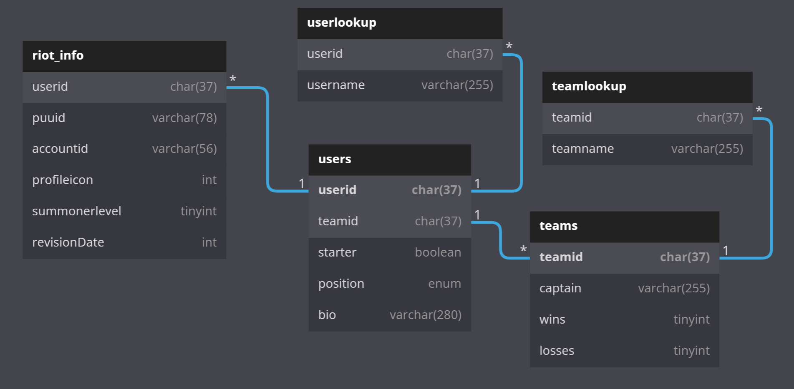

# panther-bot

This is a small project to teach me how to write good javascript, as well as 
interact with databases.

### Planned Features

- [ ] Inhouse Generator
- [ ] Panther Corps Perfomance/Stat Tracking
- [ ] LBLCS/Worlds/LXX Pickems
- [ ] Registering users and accounts
- [ ] Some fun stuff ):

### Database Mockup

This is a mockup of the registration tables. More info will eventually be stored here (with better data typing hopefully).
